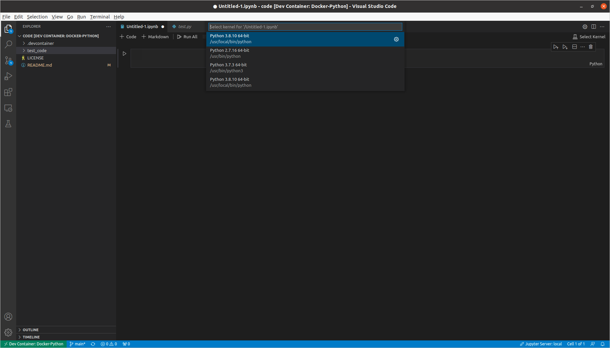

# Python環境 (Docker)
VS Code Remote Developmentを使って，Python環境を作りました．

## 動作確認
- Docker Engine 20.10.7 (Ubuntu 20.04) で確認しました．
    - Windowsでも動くとは思いますが，自分の持っているWindowsはVirtualboxを入れており，WSL2とDocker Engineを入れていないので，確認できていません．

## 基本構成
- Docker Image
    - [python](https://hub.docker.com/_/python)の[3.8.10-buster](https://github.com/docker-library/python/blob/e0e01b8482ea14352c710134329cdd93ece88317/3.8/buster/Dockerfile)を使っています．
- ディレクトリ構成
    ```
    |- test_code/   # コードを置いている
    |- .devcontainer/
        |- devcontainer.json
        |- docker-compose.yml
        |- dockerfile
        |- requirements.txt
    ```

### 各種ファイル
- ```devcontainer.json```
    - VSCodeのRemoteを使うときの設定
- ```docker-compose.yml```
    - 複数のコンテナを定義し，実行することができる．
    - 今回は，1つのコンテナに対する処理を記述
- ```dockerfile```
    - コンテナを作るための処理
- ```requirements.txt```
    - ```pip install```するファイル

## 使用時
- ```test_code```と同階層に自分のコードを格納したフォルダを配置して，VSCodeの左下の"Open Remote Window"を選択．
- Reopen in Containerを選択．
- ワークスペースが開いたら，terminalを開き，```python *.py```で実行する．

### Jupyter notebook を使う


Select kernelで，`/usr/local/bin/python` の入れたバージョンのものを選択する (同じのが複数出てきた場合はどちらか)．

Jupyter notebook (Ipython notebook) を使うためには，`pip install ipykernel jupyter` が必要．


## いろいろ変えたいとき
- ```pip install```するパッケージを変更したいとき
    - ```requirements.txt```を書き換える
- Pythonのバージョンを3の別バージョンに変えたいとき
    - ```dockerfile```のイメージファイル (2行目の```FROM```以下) を書き換える．
- Pythonのバージョンを2にしたいとき
    - [python](https://hub.docker.com/_/python)には2系がないので，イメージファイルをUbuntu等にして1からインストールする．
